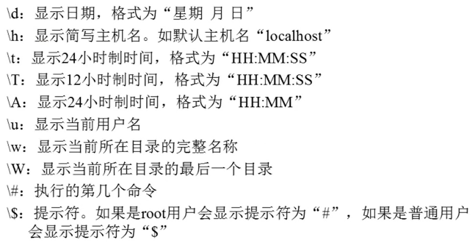
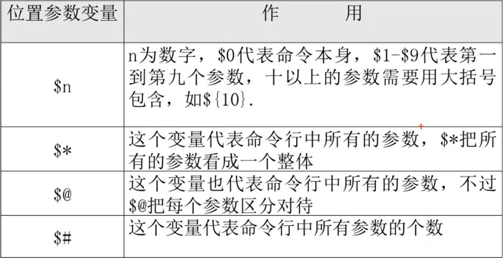

# 10.4 Shell基础-Bash变量
## 10.4.1 用户自定义变量
### 1. 变量设置规则
- 在Bash中，变量的默认类型都是字符串型，如果要进行数值运算，则必须指定变量类型为数值型
- 变量用等号连接值，等号左右两侧不能有空格
- 有空格需要用单引号或双引号括起来
- 在变量的值中，可以使用”\“转义符
- 如果需要增加变量的值，可以进行变量值的叠加，不过变量需要用双引号包含“＄变量名”或用＄{变量名}包含。
- 如果是把命令的结果作为变量值赋予变量，则需要使用反引号或＄()包含命令
- 环境变量名建议大写，便于区分

### 2. 变量分类
- 用户自定义变量
- 环境变量：主要保存和系统操作环境相关的数据
- 位置参数变量：主要是用来向脚本当中传递参数或数据的，变量名不能自定义，变量作用是固定的
- 预定义变量：是Bash中已经定义好的，不能自定义，作用也是固定的

### 3. 用户自定义变量（本地变量）
- 变量定义：name="shen chao"
- 变量调用：echo $name
- 变量查看：set
- 变量删除：unset name
- 变量叠加：
  - aa=123
  - aa="$aa"456
  - aa=${aa}789

## 10.4.2 环境变量
### 1. 环境变量是什么
- 用户自定义变量只在当前的Shell中生效，环境变量会在当前Shell和这个Shell的所有子Shell当中生效。如果把环境变量写入相应的配置文件，那么这个环境变量就会在所有的Shell中生效

### 2. 设置环境变量
- export 变量名=变量值：申明变量
- env：查询变量
- unset 变量名：删除变量

### 3. 系统常见环境变量
- PATH：系统查找命令的路径
- PATH="$PATH":/root/sh：PATH变量叠加
- PS1：定义系统提示符的变量

## 10.4.3 位置参数变量
### 1. 位置参数变量

## 10.4.4 预定义变量
### 1. 预定义变量

### 2. 接收键盘输入：read [选项] [变量名]
- 选项：
  - -p “提示信息”：在等待read输入时，输出提示信息
  - -t 秒数：read命令会一直等待用户输入，使用此选项可以指定等待时间
  - -n 字符数：read命令只接受指定的字符数，就会执行
  - -s：隐藏输入的数据，适用于机密信息的输入