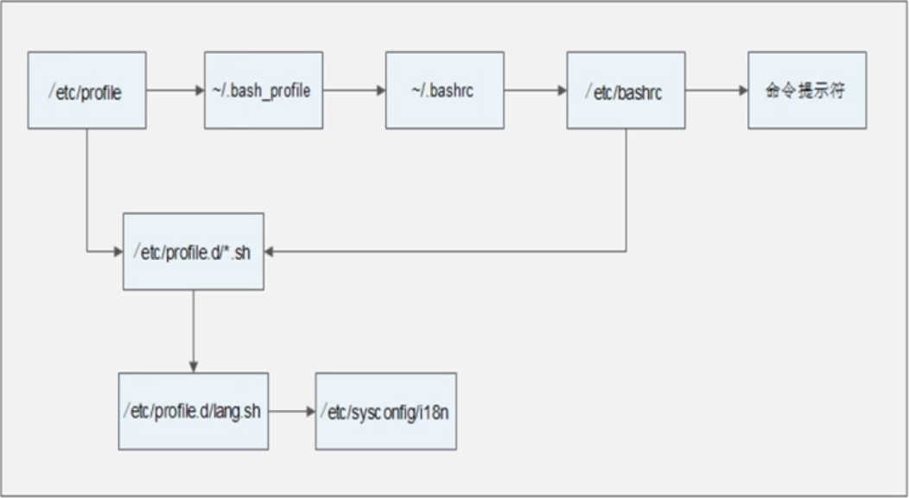
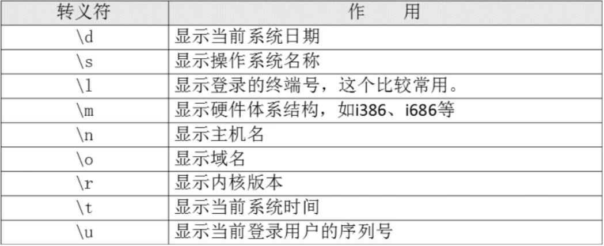

# 10.6 Shell基础-环境变量配置文件
## 10.6.1 环境变量配置文件简介
### 1. source命令
- source 配置文件
- .配置文件

### 2. 环境变量配置文件简介
- 环境变量配置文件中主要是定义对系统的操作环境生效的系统默认环境变量，比如PATH、HISTSIZE、PS1、HOSTNAME等默认环境变量。
- 配置文件：
  - /etc/profile
  - /etc/profile.d/*.sh
  - ~/.bash_profile
  - ~/.bashrc
  - /etc/bashrc
  - ~表示家目录

## 10.6.2 环境变量配置文件作用
- 调用顺序：

- CentOS7中/etc/sysconfig/i18n已变为/etc/locale.conf
1. **/etc/profile的作用：**
   - USER变量：
   - LOGNAME变量：
   - MAIL变量：
   - PATH变量：
   - HOSTNAME变量：
   - HISTSIZE变量：
   - umask：
   - 调用/etc/profile.d/*.sh文件
2. **~/.bash_profile的作用：**
   - 调用了~/.bashrc文件
   - 在PATH变量后面加入了“:＄HOME/bin”这个目录
3. **/etc/bashrc的作用：**
- PS1变量
- umask
- PATH变量
- 调用/etc/profile.d/*.sh文件
- **该调用只针对不需要输入用户密码的用户**

## 10.6.3 其他配置文件和登录信息
### 1. 注销时生效的环境变量配置文件
- ~/.bash_logout

### 2. 其他配置文件
- /bash_history

### 3. Shell登录信息
- 本地终端欢迎信息：/etc/issue

- 远程终端欢迎信息：/etc/issue.net
  - 转义符在/etc/issue.net文件中不能使用
  - 是否显示此欢迎信息，由ssh的配置文件/etc/ssh/sshd_config决定，加入“Banner /etc/issue.net”行才能显示（记得重启SSH服务）
- 登陆后欢迎信息：/etc/motd
  - 不管是本地登录，还是远程登陆，都可以显示此欢迎信息