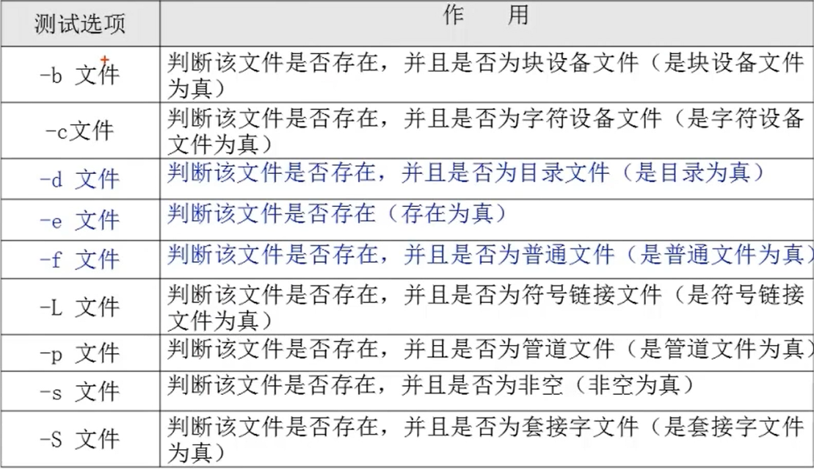
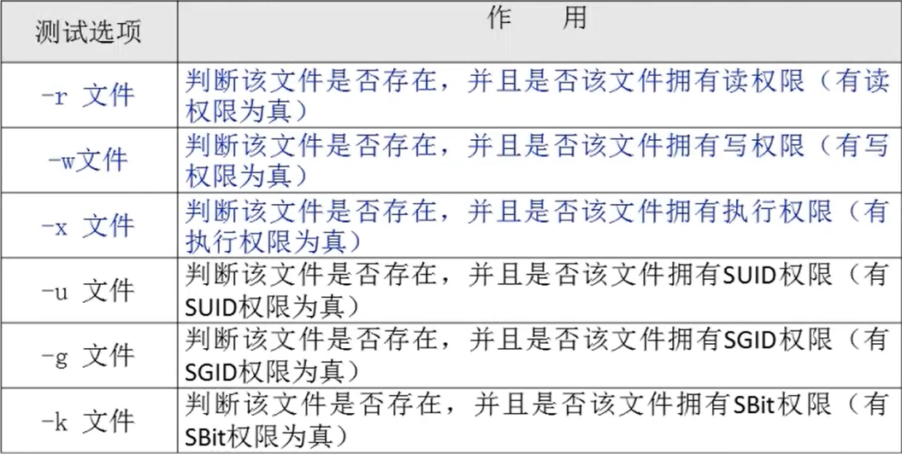
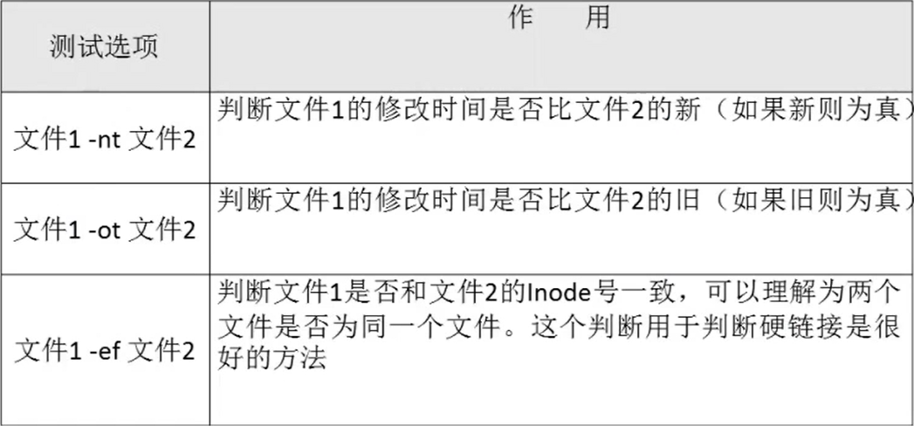
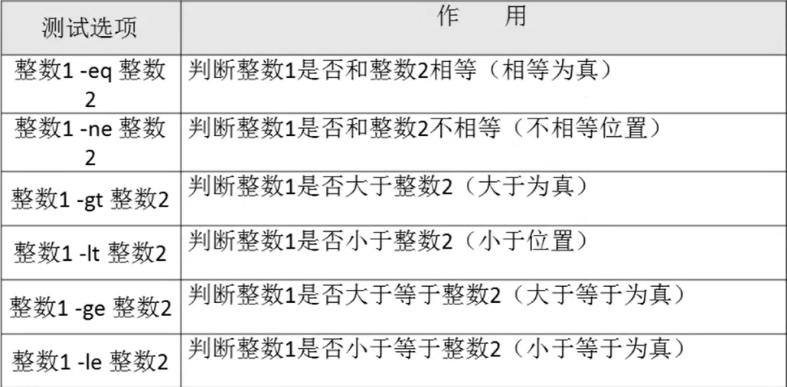
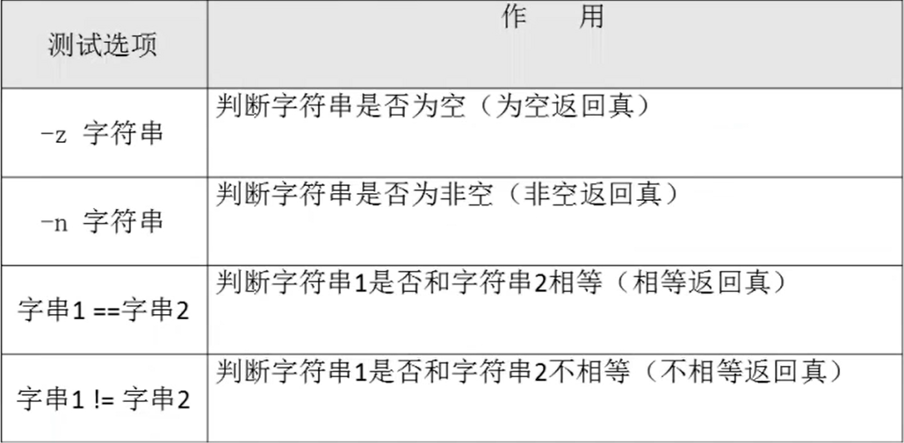
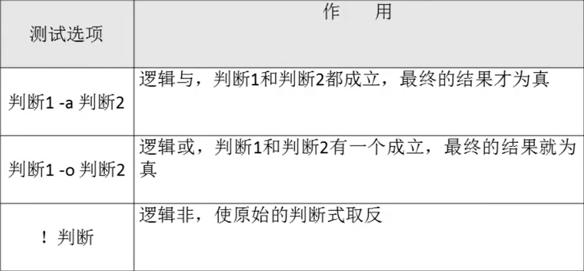

# 11.4 Shell编程-条件判断
### 1. 按照文件类型进行判断

- 两种判断格式：
  - 1. test -e /root/install.log
  - 2. [ -e /root/install.log ] (前后必须有空格)

### 2. 按照文件权限进行判断

### 3. 两个文件之间进行比较

### 4. 两个整数之间比较

### 5. 字符串的判断

### 6. 多重条件判断
