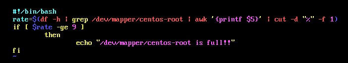
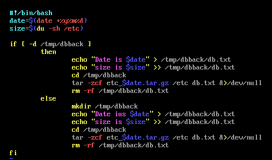
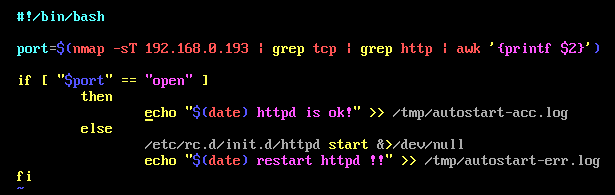

# 11.5 Shell编程-流程控制
## 11.5.1 if语句
1. 单分支if条件语句
- 格式：
```shell
if [条件判断式];then
    程序
fi
```
或者
```shell
if [条件判断式] 
    then
        程序
fi
```
- 单分支条件语句需要注意几个点
  - if语句使用fi结尾，和一般语言使用大括号结尾不同
  - [条件判断式]就是使用test命令判断，所以中括号和条件判断式之间必须有空格
  - then后面跟符合条件之后执行的程序，可以放在[]之后，用“;”分割。也可以换行写入，就不需要用“;”了。
- 案例：判断分区使用率



1. 双分支if条件语句
```shell
if [条件判断式]
    then
        条件成立时，执行的程序
    else
        条件不成立时，执行的另一个程序
fi
```




1. 多分支if条件语句
```shell
if [条件判断式]
    then
        当条件判断式1成立时，执行程序1
elif [条件判断式2]
    then
        当条件判断式2成立时，执行程序2
········
else
    当所有条件都不成立时，最后执行此程序
fi
```

## 11.5.2 case语句
- 多分支case条件语句：case语句和if…elif…ekse语句一样都是多分支条件语句，不过和if多分支条件语句不同的是，case语句只能判断一种条件关系，而if语句可以判断多种条件关系。
```shell
case $变量名 in
    "值1")
        如果变量的值等于1，则执行程序1
        ;;
    "值2")
        如果变量的值等于1，则执行程序1
        ;;
    ······
    *)
        如果变量的值都不是以上的值，则执行此程序
        ;;
    esac
```

## 11.5.3 for循环
1. 语法一：
```shell
for 变量 in 值1 值2 值3 …
    do
        程序
    done
```

该方法好处：可以批量处理同类型文件
```shell
#!/bin/bash
#批量解压缩脚本

cd /lamp
ls *.tar,gz > ls.log
for i in $(cat ls.log)
    do
        tar -zxf $i &>/dev/null
    done
rm -rf /lamp/ls.log
```

2. 语法二：
```shell
for ((初始值;循环控制条件;变量变化))
    do
        程序
    done
```
```shell
#!/bin/bash
read -p "Please input user name: " -t 30 name
read -p "Please input the number of users: " -t 30 num
read -p "Please input the password of users: " -t 30 pass
if [ !-z "$name" -a !-z "$num" -a !-z "$pass" ]
    then
    y=$(echo $sum | sed 's/[0-9]//g')
        if [ -z "$y" ]
            then
            for ((i=1;i<=num;i=i+1))
                do
                    /user/sbin/useradd $name$i &>/dev/null
                    echo $pass | /usr/bin/oasswd --stdin $name$i &>/dev/null
                done
        fi
fi
```

## 11.5.4 while循环与until循环
### 1. while循环
- while循环时不定循环，也称作条件循环。只要条件判断式成立，循环就会一直继续，直到条件判断式不成立，循环才会停止。
- 格式：
```Shell
while [条件判断式]
    do
        程序
    done
```

### 2. until循环
- until循环，和while循环相反，until循环时只要条件判断式不成立则进行循环，并执行循环程序。一旦循环条件成立，则终止循环。
- 格式：
```Shell
until [条件判断式]
    do
        程序
    done
```