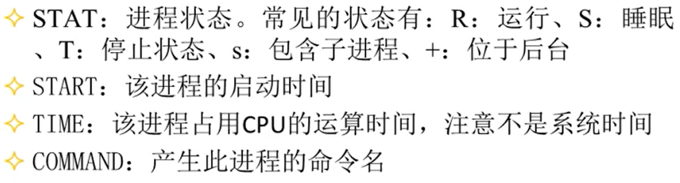
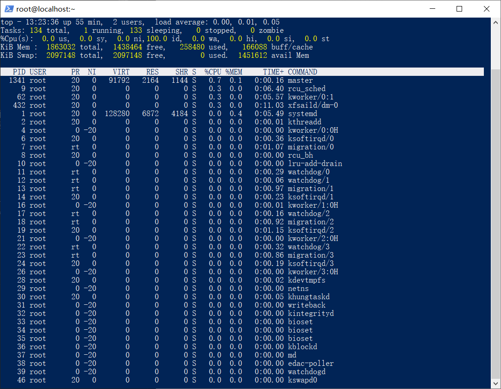
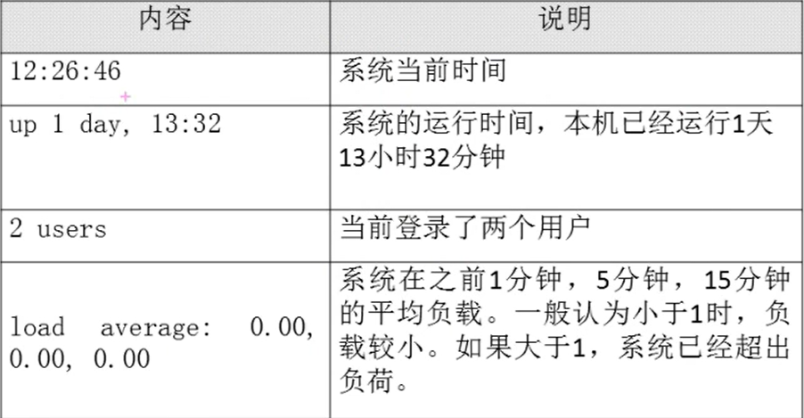
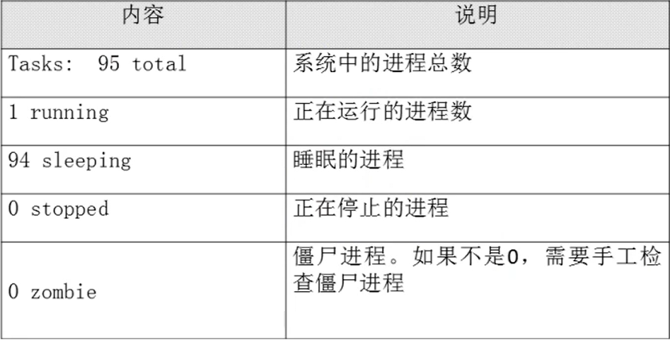
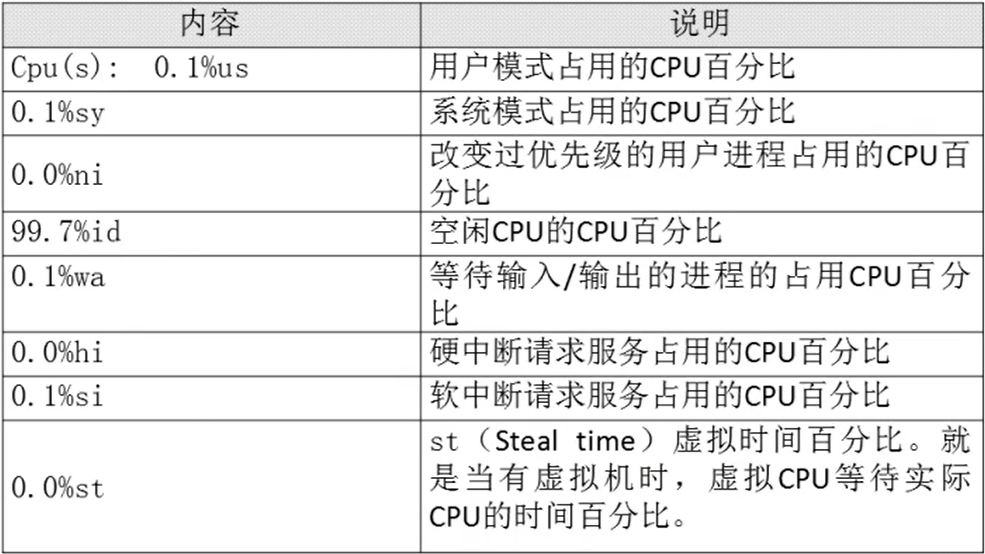
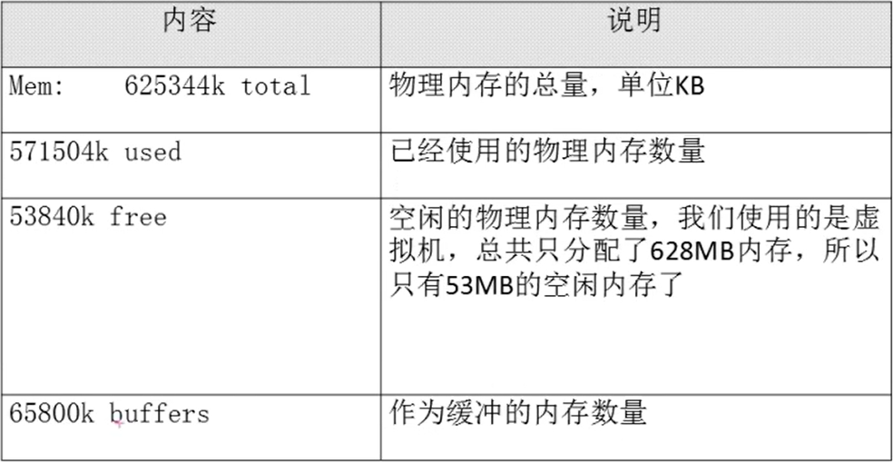
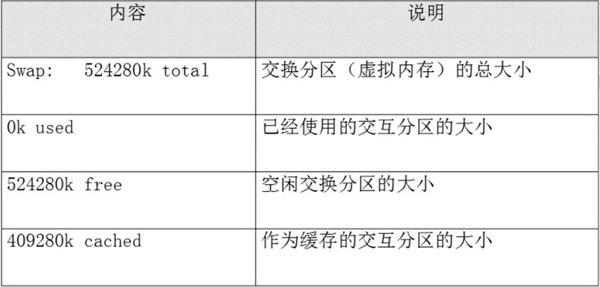
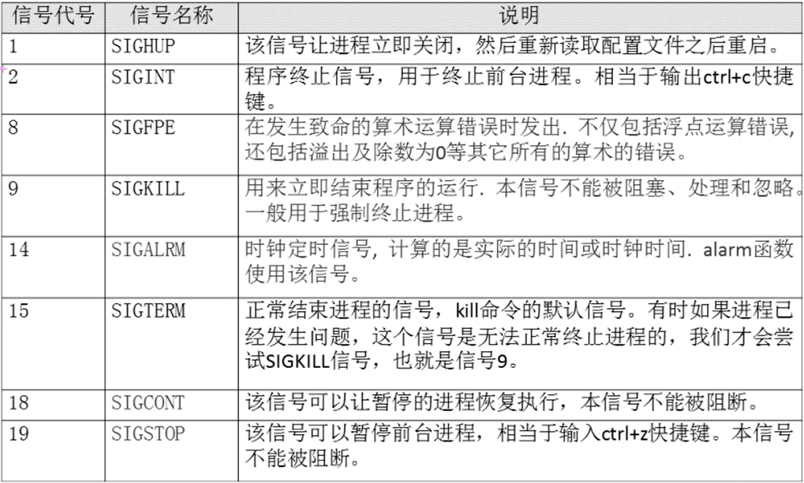

# 13.1 Linux系统管理-进程管理
## 13.1.1 进程查看
### 1. 进程简介
- 进程是正在执行的一个程序或命令，每一个进程都是一个运行的实体，都有自己的地址空间，并占用一定的系统资源。

### 2. 进程管理的作用
- **判断服务器健康状态**
- 查看系统中所有进程
- 杀死进程

### 3. 查看系统中所有进程
- ps aux：查看系统中所有进程，使用BSD操作系统格式
- ps -le：查看系统中所有进程，使用Linux标准命令格式

### 4. 查看系统健康状态top
- 格式：top [选项]
- 选项：
  - -d 秒数：指定top命令每隔几秒更新。默认是3秒
  - 在top命令的交互模式当中可以执行的命令：
  - ? 或h：显示交互模式的帮助
  - P：以CPU使用率排序，默认就是此项
  - M：以内存的使用率排序
  - N：以PID排序
  - q：退出top

- 第一行信息为任务队列信息

- 第二行为进程信息

- 第三行为CPU信息

- 第四行为物理内存信息

- 第五行为交换分区(swap)信息

### 5. 查看进程树pstree
- 格式：pstree [选项]
- 选项：
  - -p：显示进程的PID
  - -u：显示进程的所属用户

## 13.1.2 终止进程
### 1. kill命令
- kill -l：查看可用的进程信号

- kill -1 22354：重启进程
- kill -9 22368：强制杀死进程

### 2. killall命令
- 格式：killall [选项] [信号] 进程名（按照进程名杀死进程）
- 选项：
  - -i：交互式，询问是否要杀死某个进程
  - -I：忽略进程名的大小写

### 3. pkill命令
- 格式：pkill [选项] [信号] 进程名（按照进程名终止进程）
- 选项：
  - -t 终端号：按照终端号踢出用户
- 按照终端号提出用户：
  - 使用w命令：查看本机已经登陆的用户
  - pkill -t -0 pts/1：强制杀死从pts/1虚拟终端登录的进程
