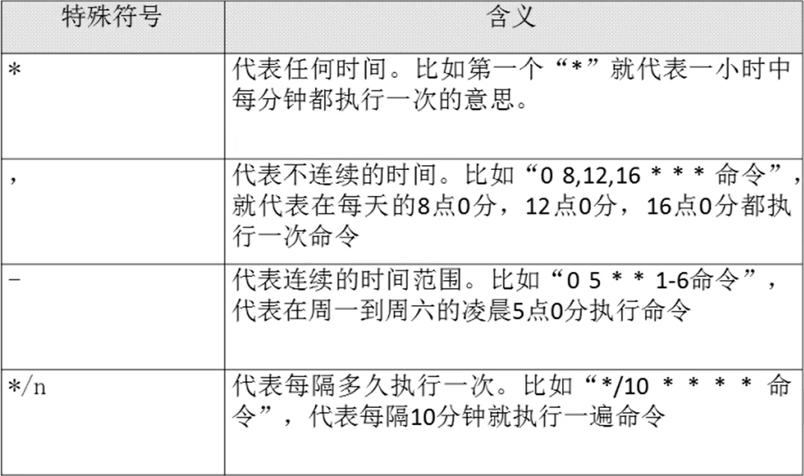

# 13.4 Linux系统管理-系统定时任务
### 1. crond服务管理与访问控制
- service crond restart
- chkconfig crond on

### 2. 用户的crontab设置
- crontab [选项]
- 选项：
  - -e：编辑crontab定时任务
  - -l：查询crontab任务
  - -r：删除当前用户所有的crontab任务
- 编写格式：* * * * * 执行的任务

- 注意：在crontab里很多符号有特殊含义，需要使用转义符