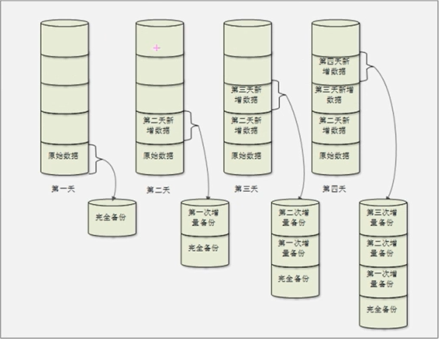
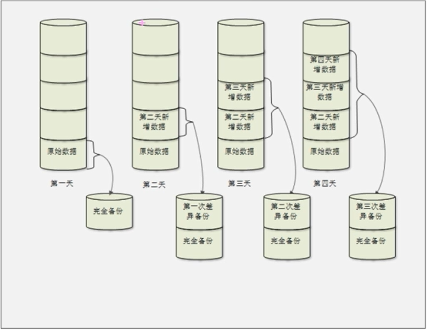

# 16.1 备份与恢复-概述
### 1. Linux系统需要备份的数据
- /root/目录
- /home/目录：
- /var/spool/mail/目录：
- /etc/目录：
- 其他目录：

### 2. 安装服务的数据
- apache需要备份的数据
  - 配置文件
  - 网页主目录
  - 日志文件
- mysql需要备份的数据
  - 源码包安装的mysql：/usr/local/mysql/data/
  - RPM包安装的mysql：/var/lib/mysql/

### 3. 备份策略
- 完全备份：完全备份就是指把所有需要备份的数据全部备份，当然完全备份可以备份整块硬盘，整个分区或某个具体的目录
- 增量备份(恢复比较麻烦)

- 差异备份(折中办法)

