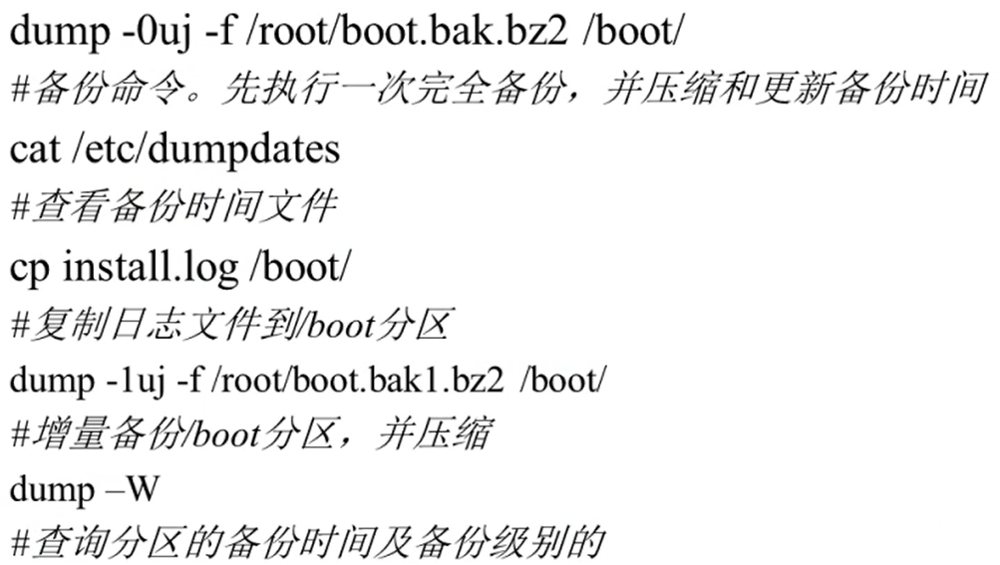
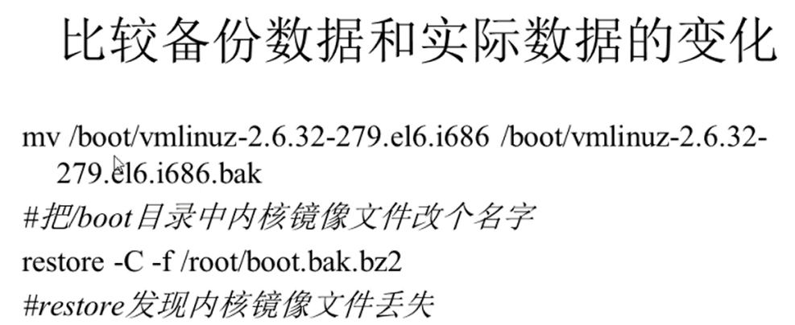

# 16.2 备份与恢复-备份命令
### 1. dump命令
- 格式：dump [选项] 备份之后的文件名 原文件或目录
- 选项：
  - -level：就是0-9十个备份级别
  - -f 文件名：指定备份之后的文件名
  - -u：备份成功之后，把备份时间记录在/etc/dumpdates文件
  - -v：显示备份过程中更多的输出信息
  - -j：调用bzlib库压缩备份文件，其实就是把备份文件压缩为.bz2格式
  - -W：显示允许被dump的分区的备份等级及备份时间
- 备份分区(CentOS7备份使用xfsdump)

- 备份文件或目录：dump -0j -f /root/etc.dump.bz2 /etc（完全备份/etc目录，只能使用0级别进行完全备份，而不再支持增量备份）

### 2. restore命令
- 格式：restore [模式选项] [选项]
- 模式选项：restore命令常用的模式有以下四种，这四个模式不能混用
  - -C：比较备份数据和实际数据的变化
  - -i：进入交互模式，手工选择需要恢复的文件
  - -t：查看模式，用于查看备份文件中拥有哪些数据
  - -r：还原模式，用于数据还原
- 选项：
  - -f：指定备份文件的文件名

