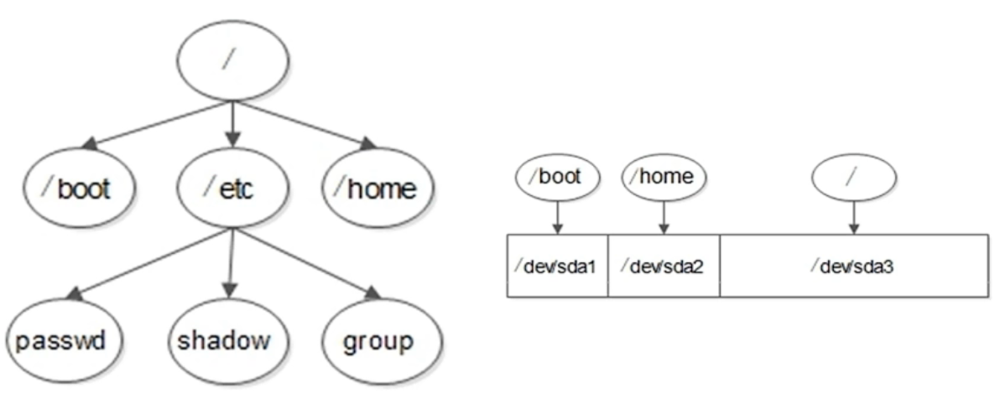

# 2.2 系统分区
## 1. 磁盘分区
**磁盘分区**是使用分区编辑器在磁盘上划分几个逻辑部分。碟片一旦划分为数个分区，不同类的目录与文件可以存储进不同的分区。
- 主分区：最多只能有4个
- 扩展分区：
1. 最多只能有1个
2. 主分区 + 扩展分区最多有四个
3. 不能写入数据，只能包含逻辑分区
- 逻辑分区

## 2. 格式化：写入文件系统
**格式化**（高级格式化）又称逻辑格式化，它是指根据用户选定的文件系统（如FAT16，FAT32、NTFS（Windows），EXT2、EXT3、EXT4（Linux）），在磁盘的特定区域写入特定数据，在分区中划出一片用于存放文件分配表、目录表等用于文件管理的磁盘空间。

Linux中，每个数据块(block)大小为4KB

格式化最主要的目的是写入文件系统，写入文件系统主要做了两个工作：把硬盘分成等大小的数据块，同时建立一个iNode列表

## 3. 硬件设备文件名：给每个分区定义设备文件名
| 硬件              | 设备文件名           |
| :---------------- | :------------------- |
| IDE硬盘           | /dev/hd[a-d]         |
| SCSI/SATA/USB硬盘 | /dev/sd[a-p]         |
| 光驱              | /dev/cdrom或/dev/sr0 |
| 软盘              | /dev/fd[0-1]         |
| 打印机（25针）    | /dec/lp[0-2]    |
| 打印机（USB）     | /dev/usb/lp[0-15]    |
| 鼠标              | /dev/mouse           |
- 分区设备文件名

/dev/hda1

/dev/sda1
- 分区号：1234是分给主分区和扩展分区的，逻辑分区一定从5开始

## 4. 挂载（Windows下叫分配盘符）：给每个分区分配挂载点（必须是空目录）
- 必须分区
  /根分区
  /swap分区（交换分区，内存2倍，不超过2GB），也就是虚拟内存
- 推荐分区
  /boot（启动分区，200MB），用于存储启动时需要的数据

根目录/ 和 /boot、/home在逻辑上是父子目录的关系，但在硬盘上它们拥有自己独立的硬盘空间**，也就是说：往/etc里写数据，保存在根目录/ 中，而往/boot和/home里写，就是保存在它们自己对应的空间里。