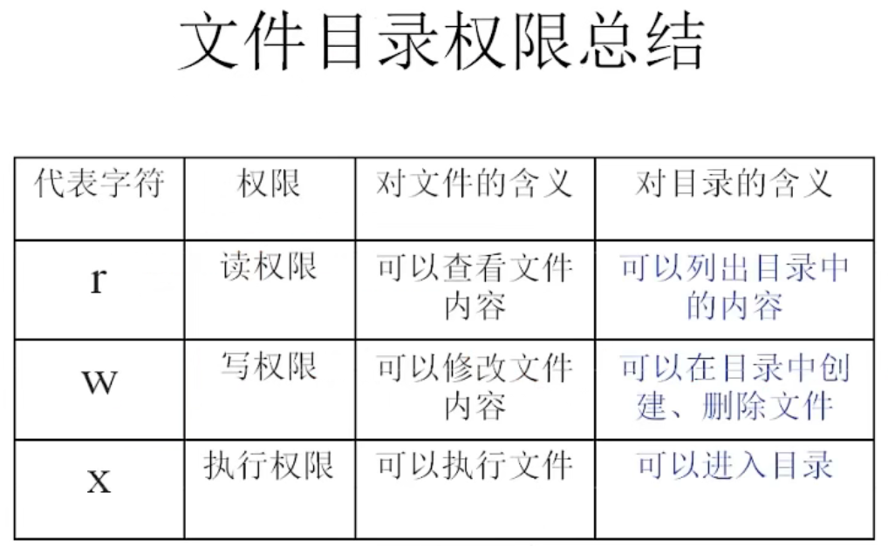
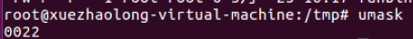

# 4.2 Linux常用命令——权限管理命令
## 4.2.1 权限管理命令chmod
### 名称：chmod
**英文原意：** change the permission mode of a file

**所在路径：** /bin/chmod

**执行权限：** 所有用户

**语法：** 
chmod [{ugoa} {+-=} {rwx}] [文件或目录] [mode=421] [文件或目录]

-R 递归修改
- 权限的数字表示

r——4

w——2

x——1

所以rwxrw-r--为764

**功能描述：** 改变文件或目录权限

## 重点**********

**删除一个文件的前提条件是这个文件的所在目录具有写权限，而不是这个文件具有写权限，文件具有写权限只是能够修改文件内容**

## 4.2.2 其他权限管理命令
### 名称：chown
**英文原意：** change file ownership

**所在路径：** /bin/chown

**执行权限：** 所有用户

**语法：** chown [用户] [文件或目录]

**功能描述：** 改变文件或目录的所属组

**范例：** chown shenchao fengjie

改变文件fengjie的所有者为shenchao

### 名称：chgrp
**英文原意：** change file group ownership

**所在路径：** /bin/chgrp

**执行权限：** 所有用户

**语法：** chown [用户组] [文件或目录]

**功能描述：** 改变文件或目录的所属组

**范例：** chgrp lampbrother fengjie

改变文件fengjie的所属组为shenchao

### 名称：umask
**英文原意：** the user file-creation mask

**所在路径：** Shell内置命令

**执行权限：** 所有用户

**语法：** umask [-S]

-S 以rwx形式显示新建文件夹缺省权限

**功能描述：** 显示、设置文件的缺省权限

**范例：** umask -S

**Linux系统中，所有新建文件都不具有可执行的权限**

这里第一个0表示==特殊权限==

022表示 --- -w- -w-

实际上的权限应该是：rwx r-x r-x（755），显示出来的是做的**与运算**