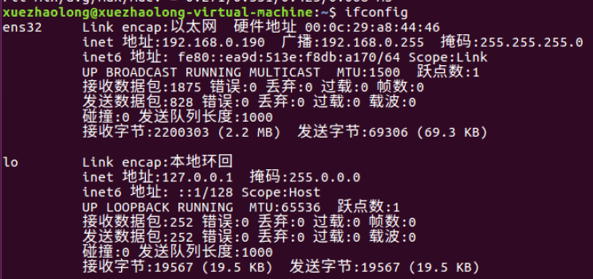

# 4.7 Linux常用命令-网络命令
### 名称：write
**所在路径：** /usr/bin/write

**执行权限：** 所有用户

**语法：** write <用户名>

**功能描述：** 给用户发信息，以Ctrl + D保存结束

**范例：** write linzhiling

### 名称：wall
**英文原意：** write all

**所在路径：** /usr/bin/wall

**执行权限：** 所有用户

**语法：** wall [message]

**功能描述：** 发广播信息（给所有在线用户发消息）

**范例：** wall ShenChao is an honest man!

### 名称：ping
**所在路径：** /bin/ping

**执行权限：** 所有用户

**语法：** ping 选项 IP地址

-c 指定发送次数

**功能描述：** 测试网络连通性

**范例：** ping 192.168.1.156

### 名称：ifconfig
**英文原意:** interface configure

**所在路径：** /sbin/ifconfig

**执行权限：** root

**语法：** ifconfig 网卡名称 IP地址

**功能描述：** 查看和设置网卡信息

**范例：** # ifconfig eth0 192.168.8.250

直接ifconfig，就是查看本机网卡信息

### 名称：mail
**所在路径：** /bin/mail

**执行权限：** 所有用户

**语法：** mail [用户名]

**功能描述：** 查看发送电子邮件

**范例：** mail root

### 名称：last
**所在路径：** /usr/bin/last

**执行权限：** 所有用户

**语法：** last

**功能描述：** 列出目前与过去登入系统的用户信息

**范例：** last

### 名称：lastlog
**所在路径：** /usr/bin/lastlog

**执行权限：** 所有用户

**语法：** lastlog

**功能描述：** 检查某特定用户上次登录的时间

**范例：** 

lastlog

lastlog -u 502

### 名称：traceroute
**所在路径：** /bin/traceroute

**执行权限：** 所有用户

**语法：** traceroute

**功能描述：** 显示数据包到主机间的路径

**范例：** traceroute www.lampbrother.net

### 名称：netstat
**所在路径：** /bin/netstat

**执行权限：** 所有用户

**语法：** netstat [选项]

**功能描述：** 显示网络相关信息

**选项：** 

-t：TCP协议

-u：UDP协议

-l：监听

-r：路由

-n：显示IP地址和端口号

**范例：** 

netstat -tlum：查看本机监听的端口（只能看到监听的）

netstat -an：查看本机所有的网络连接（还能看到正在连接的网络程序）

netstat -rn：查看本机路由表

### 名称：setup
**所在路径：** /usr/bin/setup

**执行权限：** root

**语法：** setup

**功能描述：** 配置网络

**范例：** setup

==setup更改IP地址是永久生效的==

==不是所有Linux系统都有该命令==

### 挂载命令名称：mount
**所在路径：** /bin/mount

**执行权限：** 所有用户

**语法：** mount [-t 文件系统] 设备文件名 挂载点

**范例：** mount -t iso9660 /dev/sr0 /mnt/cdrom