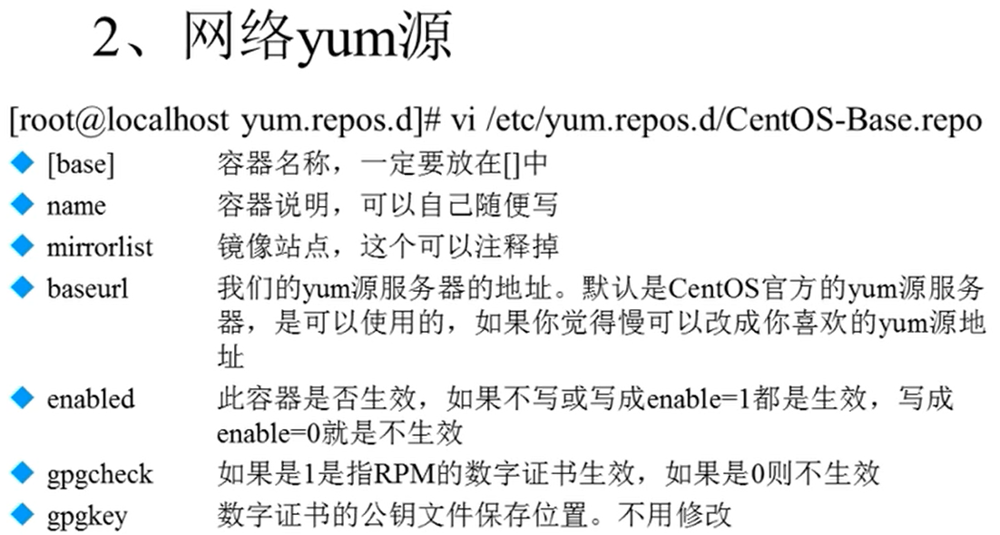
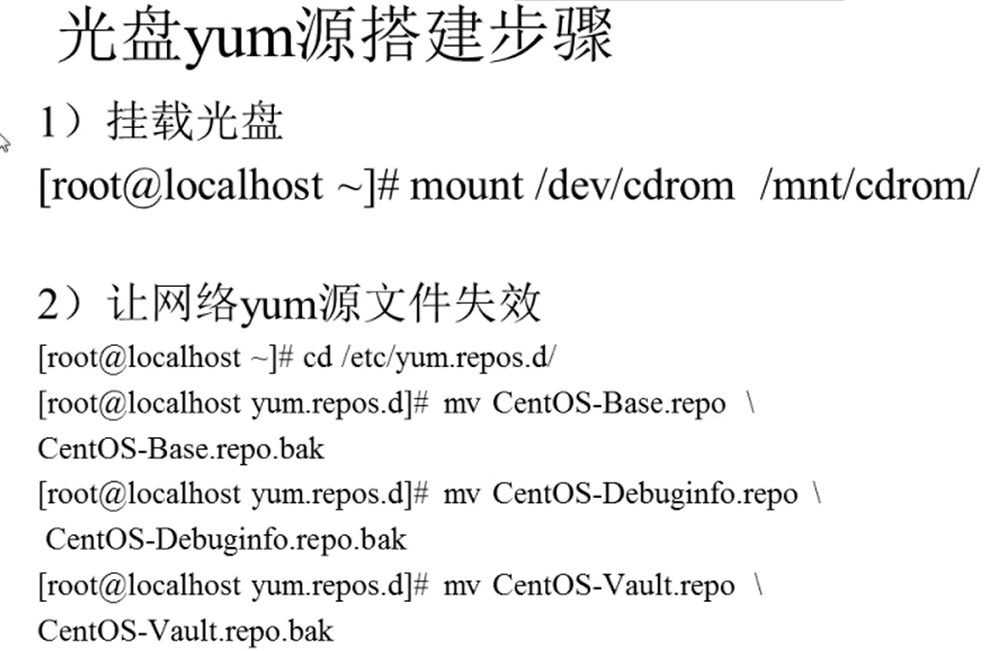
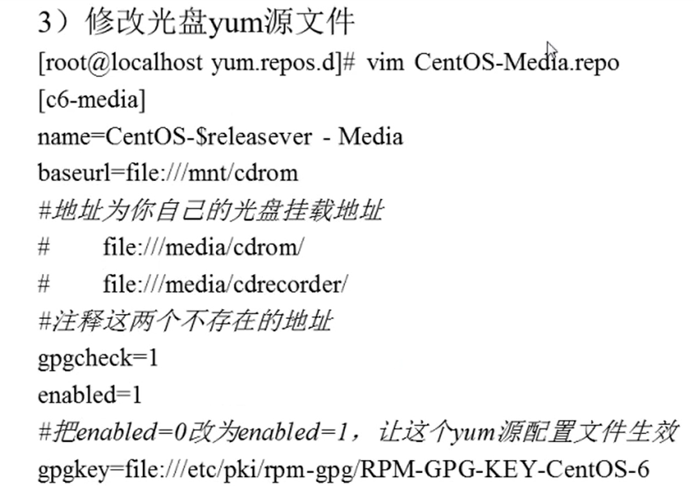

# 6.3 软件包管理-yum在线管理
## 6.3.1 IP地址配置和网络yum源
使用ifconfig配置IP地址再重启后会失效，因此需要使用**setup**命令

对于CentOS7及以上系统，设置方法如下：
- 输入：vi /etc/sysconfig/network-scripts/ifcfg-ens33（ens33为网卡名）
- 修改配置文件内容：
1. bootproto=static
2. onboot=yes
3. 在最后加上几行，IP地址、子网掩码、网关、dns服务器：

IPADDR=192.168.0.193

NETMASK=255.255.255.0

GATEWAY=192.168.0.1

DNS = 112.4.0.55

- 输入命令：systemctl restart network

## 6.3.2 yum命令
### 1. 常用yum命令
1. 查询：
yum list：查询所有可用软件包列表

yum search 关键字：搜索服务器上所有和关键字相关的包

2. 安装：
yum -y install 包名

选项：
- install：安装
- -y：自动回答yes

3. 升级：
yum -y update 包名

选项：
- update：升级
- -y：自动回答yes

4. 卸载：
yum -y remove 包名

选项：
- remove：卸载
- -y：自动回答yes

### 2.yum软件组管理命令
- yum grouplist：列出所有可用的软件组列表
- yum groupinstall 软件组名：安装指定软件组，组名可以由grouoplist查询出来
- yum groupremove 软件组名：写在指定软件组

## 6.3.3 光盘yum源搭建

