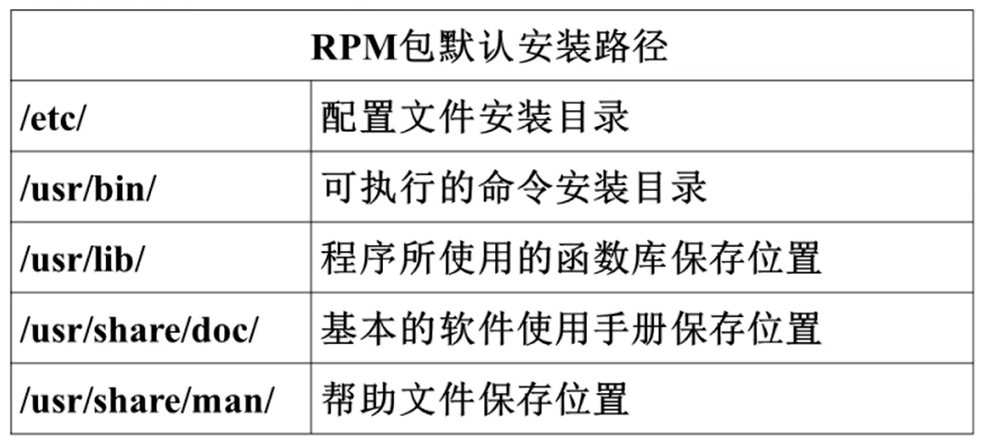

# 6.4 软件包管理-源码包管理
## 6.4.1 源码包和RPM包的区别
### 1. 区别
- 安装之前的区别：概念上的区别
- 安装之后的区别：安装位置不同

### 2. RPM包安装位置
- 是安装在默认位置中

### 3. 源码包安装位置
- 安装在指定位置当中，一般是/usr/local/软件名/

### 4. 安装位置不同带来的影响
- RPM包安装的服务可以使用系统服务管理命令(service)来管理，例如RPM包安装的apache的启动方法是：
- etc/rc.d/init.d/httpd start
- service httpd start

## 6.4.2 源码包安装过程
### 1. 安装准备
- 安装C语言编译器
- 下载源码包http://mirror.bit.edu.cn/apache/httpd/

### 2. 安装注意事项
- 源代码保存位置：/usr/local/src
- 软件安装位置：/usr/local
- 如何确定安装过程报错：安装过程停止，并出现error、warning或no的提示

### 3. 源码包安装过程
1. 下载源码包
2. 解压缩下载的源码包
3. 进入解压缩目录
4. ./configure：软件配置与检查
- 定义需要的功能选项
- 检测系统环境是否符合安装要求
- 把定义好的功能选项和检测系统环境的信息都写入makefile文件中，用于后续的编辑

### 4. 源码包的卸载
- 直接删除安装目录即可