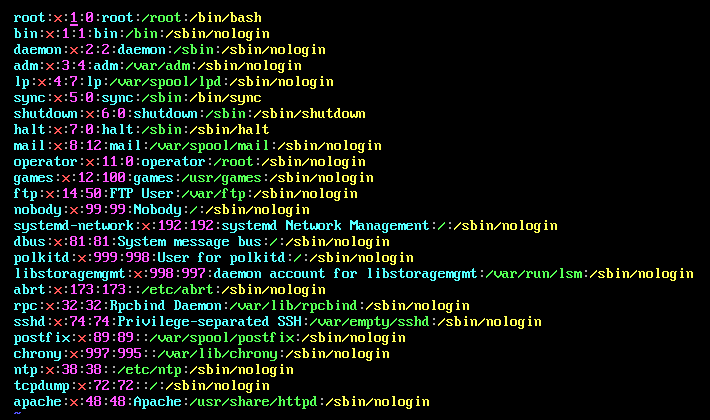

# 7.1 用户和用户组管理-用户配置文件
## 7.1.1 用户信息文件
### 1. 用户管理简介
- 越是对服务器安全性要求高的服务器，越需要建立合理的用户权限等级制度和服务器操作规范
- 在Linux中主要是通过**用户配置文件**来查看和修改用户信息

### 2. /etc/passwd
1. 第1字段：用户名称
2. 第2字段：密码标志
3. 第3字段：UID(用户ID)
- 0：超级用户
- 1-499：系统用户(伪用户)
- 500-65535：普通用户
4. 第4字段：GID(用户初始组ID)
5. 第5字段：用户说明
6. 第6字段：家目录
- 普通用户：/home/用户名/
- 超级用户：/root/
7. 第7字段：登录之后的Shell

### 3. 初始组和附加组
- 初始组：就是指用户一登录就立刻拥有这个用户组的相关权限，每个用户的出十足只能有一个，一般就是和这个用户的用户名相同的组名作为这个用户组的初始组。**一般不要修改！**
- 附加组：指用户可以加入多个其他的用户组，并拥有这些组的权限，附加组可以有多个。

### 4. Shell是什么
- Shell就是Linux的命令解释器
- 在/etc/passwd当中，除了标准Shell是/bin/bash外，还可以写如/sbin/nologin

## 7.1.2 影子文件
### 1. 影子文件/etc/shadow
1. 第1字段：用户名
2. 第2字段：加密密码
- 加密算法升级为SHA512散列加密算法
- 如果密码位是“!!”或者“*”代表没有密码，不能登录
3. 第三字段：密码最后一次修改日期
- 使用1970年1月1日作为标准时间，每过一天时间戳加1
4. 第4字段：两次密码的修改间隔时间(和第3字段相比)
5. 第5字段：密码有效期(和第3字段相比)
6. 第6字段：密码修改到期前的警告天数(和第5字段相比)
7. 第7字段：密码过期后的宽限天数(和第5字段相比)
- 0：代表密码过期后立即失效
- -1：则代表密码永远不会失效
8. 第8字段：账号失效时间，要用时间戳表示
9. 第9字段：保留

### 2. 时间戳换算
- 时间戳换算为日期：date -d "1970-01-01 16066 days"
- 日期换算为时间戳：echo $(($(date --date="2014/01/06" +%s)/86400+1))

## 7.1.3 组信息文件
### 1. 组信息文件/etc/group
- 第1字段：组名
- 第2字段：组密码标志
- 第3字段：GID
- 第4字段：组中附加用户(只能看到附加用户，看不到初始 用户)

### 2. 组密码文件/etc/gshadow
- 第1字段：组名
- 第2字段：组密码
- 第3字段：组管理员用户名
- 第4字段：组中附加用户